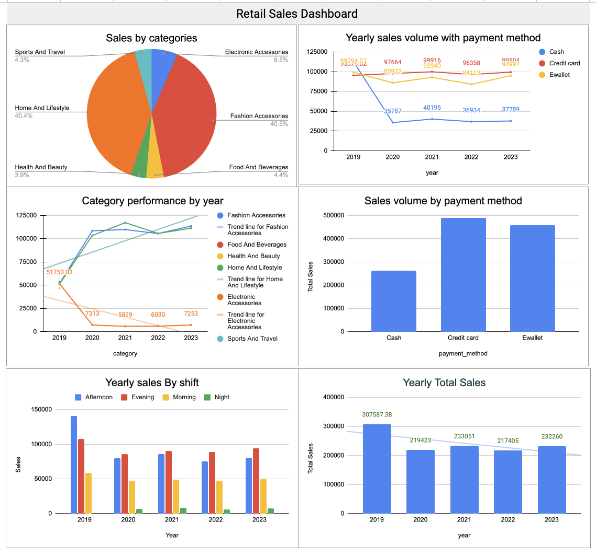

# Retail Sales trends insights - Project Overview 
## Background and Overview
As data analysis plays a crucial role in the all types of industries, enabling businesses to make informed decisions, make informed planning, optimize operations, and enhance overall experiences on different segmentations. 
Here for personal learning and gaining insights on retail sales trends, I will be performing wide range of analysis. This dataset contains 9969 rows and 9 columns 

## Goal 
* Analyze sales trends by categories
* Get insights on year over year performance
* Find statistical values from sales data
* Create new metrics and generate valuable insights
* Make recommendations based on the findings

Note: This is a plannning stage. 
  
## Data Structure (Schemas)
```sql
    -- Drop the table if it is exist in the database
       DROP TABLE IF EXISTS retail_sales;	
      
      -- Create a table called retail_sales
    	CREATE TABLE retail_sales (
          invoice_id INT PRIMARY KEY,
          city VARCHAR(50),
          category VARCHAR(50),
          unit_price NUMERIC(10, 2) NOT NULL CHECK (unit_price > 0),
          quantity INT NOT NULL CHECK (quantity > 0),
          sale_date DATE NOT NULL,
          sale_time TIME,
          payment_method VARCHAR(20) NOT NULL,
          rating NUMERIC(10, 2)
        );
```
## Analyze the datasets( SQL -PostgreSQL)
#### Q.1 Find the unique cities 
```sql
  	select distinct city from retail_sales;
     -- Answer:  There are total of 98 unique cities
```
#### Q.2 Find total number of unique categories
```sql
    select distinct category from retail_sales;
    -- Answer: there is 6 unique category
```
#### Q.3 Which categories generate the highest and lowest revenue?
```sql
    SELECT
         'Highest Revenue' AS type,
          category,
          total_revenue
    FROM ( SELECT
              category,
              SUM(unit_price * quantity) AS total_revenue,
              RANK() OVER (ORDER BY SUM(unit_price * quantity) DESC) as rn_desc
    					FROM retail_sales
              GROUP BY category
          	) AS ranked_categories
    WHERE rn_desc = 1
    			
    			union all

    SELECT
          'Lowest Revenue' AS type,
           category,
           total_revenue
    			FROM ( SELECT
    			        category,
    			        SUM(unit_price * quantity) AS total_revenue,
    			        RANK() OVER (ORDER BY SUM(unit_price * quantity) ASC) as rn_asc
    			    FROM retail_sales
    			    GROUP BY category
    			) AS ranked_categories
    WHERE rn_asc = 1;
```
#### Q.4 What is the average order value, and how does it vary by category?
```sql
      select 
      	category,
      	round(avg(unit_price * quantity),2) as avg_sales
      from retail_sales
	    group by category
      order by avg_sales desc;
```
#### Q.5 What are the most common payment methods used by customers?	
```sql
    select
          payment_method,
          count(*) as cnt
    from retail_sales
    group by payment_method
    order by cnt desc ;

-- Answer: Credit , Ewallet , Cash are the payment method used from higest to lowest
```
#### Q.6 Which days of the week have the highest sales volume?
```sql
      select
          to_char(sale_date,'Day') as day_of_week ,
          count(*) as cnt
      from retail_sales
      group by 1
    	order by cnt desc ;
```
# Operational Insights
#### Q.7 How does sales performance vary by time of day (e.g., morning vs. evening)?
```sql 
		-- Note: Store opens from morning 6 to late night 23 ( 11pm)
    With time_shifts as (
     select
             case
                  when sale_time >= TIME '06:00:00' and sale_time < TIME '12:00:00' then 'morning'
                  when sale_time >= TIME '12:00:00' and sale_time < TIME '17:00:00' then 'afternoon'
                  when sale_time >= TIME '17:00:00' and sale_time < TIME '21:00:00' then 'evening'
                  else 'late_night'
              end as sale_shift,
              unit_price * quantity AS total_sales
         from retail_sales
			)
    select
        sale_shift,
        sum(total_sales) as total_revenue
    from time_shifts
    group by sale_shift
    order by total_revenue desc;
```
#### Q.8 Find the month over month sales growth in year 2023 
```sql

	With cte as (
			select 
			  to_char(sale_date,'yyyy/mm') as month,
			  sum(unit_price * quantity) as sales
			from retail_sales
			where extract(year from sale_date) =2023
			group by month
	)
	select 
	  * ,
  	round( ((sales - previous_sale) *100)/previous_sale,2) as mom_growth
	
	from(
	select * , 
	      lag(sales,1,sales) over( order by month) as previous_sale
	from cte  );
-- April performed the worst and November Sales growth is highest. 
```
#### Q.9 Find year over year growth in sales  
```sql
    with cte as (
    	select 
        	distinct extract('Year' from sale_date) as year, 
        	sum(unit_price * quantity) as yearly_sale
    from retail_sales
    group by year
    order by year ), 
    cte_sales as ( select *, lag(yearly_sale,1,yearly_sale) over(order by year ) as previous_sale from cte )

    select *,
       round((yearly_sale - previous_sale) *100 / previous_sale ,2) as yoy_growth
    from cte_sales;
-- 
```

#### Q.10 Find the average rating by category 
```sql
    
     select 
       category,
       round(avg(rating),2) as avg_rating
     from retail_sales
     group by category 
     order by avg_rating desc
 -- Note: Food and beverage has highest average rating while home and life style has lowest average rating. 
```
# Findings and insights. 

 * We have customers from 98 different cities.
 * We have 6 different categories of different items.
 * Fashion accesories generated the largest total sales volumn of 489480.90 from 2019-2023 while health and beauty generated total sales revenue of 46851.18 which is lowest sales revenue among categories
 * Sport and travel have the best average sales while the health and beauty has lowest average sales.
 * Credit card is widely used followed by Ewallet and Cash respectively.
 * By sales average, all week days are performing well even though it slows down on monday.
 * Most of the customers are shopping in afternoon and evening followed by morning and night.
 * The food and beverage has highest customer satisfaction of 7.11/10 while home and life style has 5.74 /10.

# Dashboard ( Static Screenshoot)

  
# Recommendations

* We have many customers from different cities like 98, but we recommend to reach mor cities to generate more revenue.
* Fashion accessories generated highest revenue while health and beauty generated lowest revenue. so it is important to look and dive deep into finding the causes of such low sales in health and beauty categorical sales.
* It will be important if can improve marketing stragedy for sport and travel and Fashion accessories to improve existing and generate more revenue. Also it is adivised to find why health and beauty sales performing poor.
* It is important to build and create seamsless credit card and Ewallet payment system because large section of customer used them as payment method. A poor online payment system will may cause customer retention problems by increasing the customer churn rate.
* Monday has lowest average sales while rest of the days has no big differences on sales.So plan accordingly.
* More sales revenue are generated at evening and afternoon. So it is important to focus on these areas.
* The average rating is 5.83 and the food and beverage has highest customer satisfaction of 7.11/10 while home and life style has 5.74 /10. so we need to dive deeper into the causes of poor rating and need to find out why and need to strategize how to improve the rating on all categories.


  
## Tools Used
* SQL - PostgreSQL
* Pgadmin - Database.
* Python - Pandas, numpy
* Excel
* Jupyter Notebook.  

# Technical details
* With jupyter notebook, did data cleaning and structured in a way that it is easy to understand, reuseable and concise to use.
* Removed duplicate and null values based on the business needs. ( Python - Pandas)
* Exported cleaned data to pgAdmin and Excel to perform further analysis.
* Important business problems are solved with using SQL queries.
* Created a simple dashboard and pivot tables to answer business questions using Excel.
  

  

